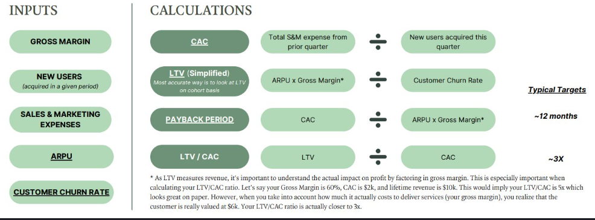

<!-- TOC -->
- [Key Statements](#key-statements)
  - [Mission](#mission)
  - [Vision](#vision)
  - [Strategy](#strategy)
  - [Goals](#goals)
  - [Roadmap](#roadmap)
  - [Execution](#execution)
  - [Business Model Canvas](#business-model-canvas)
- [For PPT --](#for-ppt---)
- [Page 1 - Start](#page-1---start)
- [Page 2 - Brief Problem](#page-2---brief-problem)
- [Page3 - Brief On Us](#page3---brief-on-us)
- [Page 4 - Problem Details](#page-4---problem-details)
- [Page 5 - Solution Details](#page-5---solution-details)
- [Page 6 - Different Use Cases](#page-6---different-use-cases)
- [Page 7 - GTM Strategy](#page-7---gtm-strategy)
- [History](#history)
- [Page 8 -](#page-8--)
- [Next Quarter Targets with Digital Ecosystem and Livestock focus](#next-quarter-targets-with-digital-ecosystem-and-livestock-focus)
<!-- /TOC -->

# Key Statements

## Mission

Produce affordable regional organic food for migrant Bengali Community in Hyderabad using BioDynamic Farming.

## Vision 

Utlize abundant Low Cost Lands and do Biodynamic farming and produce affordable organic food and deliver it with a optimized digital ecosystem.

## Strategy

Take low-cost lands in lease and apply Biodynamic system,produce rare and low risk regional vegetables like creepers and develop customer base.Then keep delivering value added services groceries and snacks.Gain maturity in Biodynamic system and produce export ready crops and scale up livestock ecosystem.Gradually create a sustainable economic system with Regional Foods/ Livestocks / Affordable Organics / Exports.

## Goals

Deliver rare regional affordable organic foods to migrant Bengalis.

## Roadmap 
-   Focus on low risks creepers and regional choices.
-   Focus on livestock to have a sustainable econimic system.
-   Produce complete Agriculture Management Suite of products for digital ecosystem.
-   Produce Export Quality  Papaya && Drumstick and create revenues.
-   Earn revenues through digital ecosystem.

## Execution 

Start with 1 land and apply the biodynamic ecosystem and establish digital ecosystem to optimize the outcome and create a ecomically viable system and scale it up.Initially focus on low risk creepers.

Develop a sustainable live stock ecosystem.

Next tap the export market.

Esatblish the E2E digital ecosystem to scale this up.

Example Canvas:

## Business Model Canvas
Key Partners --
- Farmers and Agronomist
- Procurement Specialists
- Investors

Key Activities --
- BioDynamic Farming
- Digital platform dev & maint
- Maketing and Ads
- Farmers Connect
- Procurements
- Distributions and Operations

Key Resources--
- Tech Platform
- Procurement Specialists
- Farmers Network
- Agronomists
- Brand
  
Value Proposition 
- Platform to Connect Farmers with End Consumer 
- Availability of Regional/ Rare Items- B2C
- Organic Equivalent Food at Normal Price- B2C
- Export B2B

Channels -
- Websites
- Mobile App
- Social Media
- Weekly Market
- Promotions in Festivals

Customer Relationship
- Feedback/ ratings
- Sentiment Analysis

Customer Segments
- Upper Middle Class Bengali/ Odissa / North Indian families
- Educated people looking for cost effective alternatives of Organic Food.

Cost Structure
- Employee Payroll
- Production
- Procurement Cost
- Tech Platform
- Sales & marketing
- Farm Lease
- Farm Maintenance
- Equipment Management
- Emergency Management
  
Revenue Streams
- Rs/Order
- Exports

Finacials:

# For PPT --
Bongobasi.com

# Page 1 - Start 

Home Away from Home for Migrant Bengalis in Hyderabad

# Page 2 - Brief Problem

10 Lacs Bengali population in Hyderabad.10% of them ready to spend more for their Regional Foods

Less than 1% demand is met with current supply.

# Page3 - Brief On Us
Bongobasi.com -

Produce rare regional affordable organic foods using Bio Dynamic farming and distribute to migrant Bengalis through a digital platform.

# Page 4 - Problem Details

Less than 1% of Bengali Migrants get access to Bengali Foods. They are super costly , imported.There are no hyderabad based Digital Platform.

Why low availability -

Difficult to produce them locally , need bengal expertise.Transport cost is high and risky.

# Page 5 - Solution Details

Bongobasi - 
  - Producing Locally -Able to emulate Bengali Ecosystem in Hyderabad (Nature+ Expertise)
  - Quality - People know us now for Quality
  - Affordability - First time affordable Bengali Foods that is Organic
  - E2E Digital Ecosystem - A complete E2E Digital platform ensuring direct F2C program

# Page 6 - Different Use Cases

Dialy Vegetables - Bengali Veggeies and Leafy specific that is rare.
Groceries - Catering Bengali Grocery Needs Also in Existing customers base
Fish - Beramuda / Singhi / Bhola / Koi / Tangra - local production of regional fishes 
Livestock - Hen Eggs , Desi Chicken , Duck Eggs, Black Bengal Goats
Puja Items -Specific Puja Packages 

# Page 7 - GTM Strategy

Rare Vegetables : Tap Bengali Customers Bases with rare vegetables like creepers
Rare Groceries / Snacks - Increase sales volume with rare groceries and snacks
Livestock - Penetrate more with Free Roaming Eggs / Duck Eggs / Desi Chicken / Goats
Export - Export our successful product papaya/drumsticks

# History 

2021 - Started with a 13 Acre Farm for our own needs
2022-  Major Learning Process
2023-  Some Succesful Products + Customer Aquisitions  
2024-  Customer Retention / Digitization / Zeroing Loss
2025-  Profitable Model - Repeat success.

Success -
  1. Bengali Creepers & Bengali Specialities
  2. Papaya && Drumsticks
  3. livestock
  4. Digital Ecosystem & Partnering

Failures -  

  - Rice / Daal / Pulses / Corn
  - Some leafy Bengali vegetables
  - High Coverage Vs High Care

# Page 8 - 

Strong Validated Metrics

Customer Base - 1000 
Monthly Order Volume -1300 
Average Order Value-450 Rs (veg + Grocery)
Margin -10-50% 
Avg Margin - 35% 
Wastage - 15%
Grosss Margin- 20%
CAC-Customer acquisition cost-400
LTV- lifetime value per customer- 2L
ARPU(Average Revenue Per User)
Customer Churn Rate -

MRR - 6.7L
  Vegetable / Grocery Sales - 5800000/M
  Livestock -20K/M - (Eggs Sale)
  Papaya/Drumstick Sales/Creeper Sales -70K/M

Opex -11.1L
    Digital Ecosystem- 2.2L/M
    Field Employees-1.8L/M 
    Procurements - 4L/M
    Land Lease -40k/M
    House Rent 60K/M
    Vehicle Maintenance-50k/M
    Vehicle Loans-60k/M
    Farm Maintenance -50k/M
    Capital Interest- 50K/M

2024-25- Q2 --MRR-6.7L Opex-11.1L(O(1200/M)+ L(20K)+A(70k)

2024-25- Q3 --MRR- 12L Opex -13L (O(2500)+ L(70K)+A(1L))

2024-25- Q4 --MRR- 21L Opex -18L (O(4000)+ L(1L)+A(2L)))

Total Market Size -- 
    O-200000/M  100 Crore/Yr- HYD
    Livestock - 1000 Crore
    Export    - 2000 Crore

#  Next Quarter Targets with Digital Ecosystem and Livestock focus

Customer Base - 1500 
Monthly Order Volume -4000
Average Order Value-450 Rs  
Margin -20-50% 
Avg Margin - 40% 
Wastage - 5%
Grosss Margin- 35%

MRR - 21L/M
  Vegetable / Grocery Sales - 18L/M
  Livestock -1L/M - (Eggs Sale/Desi Chicken)
  Papaya/Drumstick Sales/Creeper Sales -2L/M

Opex - 18.1L
    Digital Ecosystem- 2.2L/M
    Field Employees-4L/M 
    Procurements - 8L/M
    Land Lease -40k/M
    House Rent 60K/M
    Vehicle Maintenance-50k/M
    Vehicle Loans-60k/M
    Farm Maintenance -50k/M
    Capital Interest- 50K/M
    Sales Effort-1L

Competitors:
India Cuisine https://indiacuisine.net/
Bhojohori Manna
https://www.bengalsouk.com/
https://thestateplate.com/
https://bonghaat.com/
https://indiacuisine.net/
Amazon Bengali Sections
https://homefoodi.com/
https://www.kolkatasholoana.com/
https://www.bongoruchi.com/
https://www.bongmela.com/
Vegrow
Deep Rooted.Co

Assets -
- 1000 Customers Base
- Branded As High Quality 
- Two super quality products(papaya and Moringa)
- Successfull Creeper Production
- Successful Livestock Ecosystem
- Channel / Partnership (F2C)
- Vehicles && Accessories