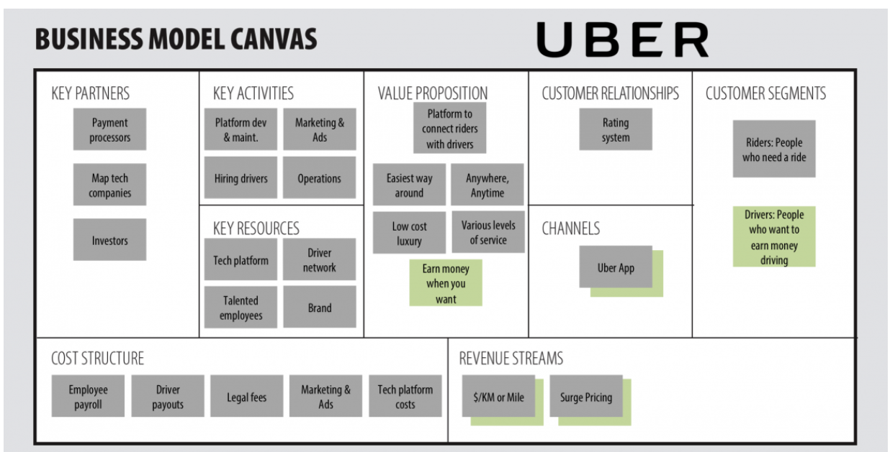

<!-- TOC -->
- [Key Statements](#key-statements)
  - [Mission](#mission)
  - [Vision](#vision)
  - [Strategy](#strategy)
  - [Goals](#goals)
  - [Roadmap](#roadmap)
  - [Execution](#execution)
  - [Business Model Canvas](#business-model-canvas)
<!-- /TOC -->

# Key Statements

## Mission

Produce Healthy Food at Optimal Cost using BioDynamic Farming and create Jobs.

## Vision 

Utlize Low Cost Waste Lands,Apply Biodynamic farming and produce healthy food at Optimal Cost and deliver it with a optimized digital ecosystem.

## Strategy

Applying Biodynamic system,produce rare and low risk regional vegetables like creepers and develop customer base.Then keep delivering value added services like more foods and groceries.Gain maturity in Biodynamic system and produce export ready crops and scale up livestock ecosystem.
Gradually distribute ready made food to reduce waste.

## Goals

A complete natural healthy food is delivered directly to end users at a optimal cost.

## Roadmap 

-   Focus on low risks creepers and regional choices.
-   Focus on livestock to have a sustainable econimic system.
-   Produce complete Agriculture Management Suite of products for digital ecosystem.
-   Produce Export Quality  Papaya && Drumstick and create revenues.
-   Earn revenues through digital ecosystem.

## Execution 

Start with 1 land and apply the biodynamic ecosystem and establish digital ecosystem to optimize the outcome and create a ecomically viable system and scale it up.Initially focus 
on export products.

Next tap the regional(Bengali) food market and focus on creepers that is low risk and hig demand.

Esatblish the E2E digital ecosystem to scale this up.

Example Canvas:

## Business Model Canvas
Key Partners --
- Farmers and Agronomist
- Procurement Specialists
- Investors

Key Activities --
- BioDynamic Farming
- Digital platform dev & maint
- Maketing and Ads
- Farmers Connect
- Procurements
- Distributions and Operations

Key Resources--
- Tech Platform
- Procurement Specialists
- Farmers Network
- Agronomists
- Brand
  
Value Proposition 
- Platform to Connect Farmers with End Consumer 
- Availability of Regional/ Rare Items- B2C
- Organic Equivalent Food at Normal Price- B2C
- Export B2B

Channels -
- Websites
- Mobile App
- Social Media
- Weekly Market
- Promotions in Festivals

Customer Relationship
- Feedback/ ratings
- Sentiment Analysis

Customer Segments
- Upper Middle Class Bengali/ Odissa / North Indian families
- Educated people looking for cost effective alternatives of Organic Food.

Cost Structure
- Employee Payroll
- Production
- Procurement Cost
- Tech Platform
- Sales & marketing
- Farm Lease
- Farm Maintenance
- Equipment Management
- Emergency Management
  
Revenue Streams
- Rs/Order
- Export

    
