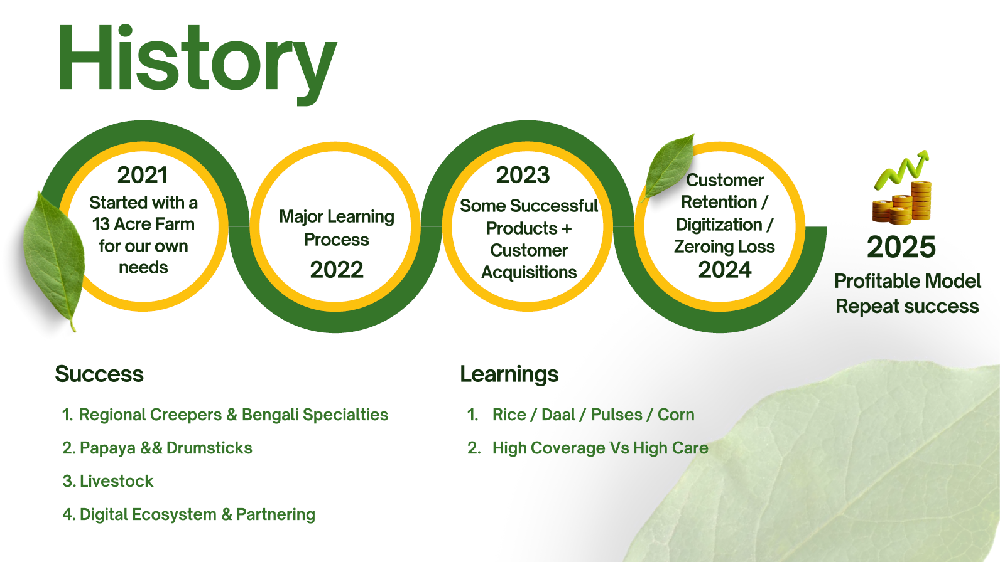

# Executive Summary

Business Name: Promode Agro Farms

Location: India Hyderabad

Business Type: Organic & Biodynamic Farming

Founder: Papu Bhattacharya, Akbar Ahmed Khan, Tina Chakroborty 

# Vision

To create sustainable agricultural practices while providing regional food access to local communities, 
especially migrant populations.

# Mission

To offer biodynamic, organic produce at affordable prices while building an end-to-end digital ecosystem for seamless farm-to-consumer services.

# Company Overview

Founded in 2021, Promode Agro is committed to producing affordable organic food while developing a cutting-edge 
end-to-end digital ecosystem for seamless farm-to-consumer (F2C) services. Our mission is to bridge the gap 
between high-quality organic food and accessibility, ensuring that everyone can benefit from sustainable 
farming practices.

Our products have resonated strongly with the migrant population in Hyderabad, who value familiar, region-specific food 
options. Recognizing this need, we have strategically focused on producing local food tailored to their preferences, 
strengthening our connection with this community while staying true to our core values of sustainability and innovation.

Promode Agro operates on a unique combined ecosystem of affordable organic food, livestock management, and 
export-ready products, all supported by a highly reliable and scalable digital platform. This holistic approach 
ensures that our mission remains sustainable and scalable, driving steady growth year over year.

Here are Key Highlights of Promode Agro,

Customer Base: Approximately 1,000 customers served monthly.
Revenue: Generating ₹10 lakh in monthly revenue.
Team: A passionate team of 26 members driving our mission forward.
Digital Innovation: Successfully launched an F2C digital MVP for seamless farm-to-consumer operations.
Product Excellence:
Export-ready crops: High-quality papaya and drumstick.
Sustainable livestock ecosystem: Designed to complement our organic food production.

Promode Agro continues to thrive by combining agricultural expertise, digital innovation, and a deep commitment to 
sustainability, making us a trusted partner in the organic farming landscape.Over the past three years, we have successfully developed a niche customer base and achieved predictable profitability, with a clear path for scaling.

I am reaching out because I believe Promode Agro’s mission aligns with your investment focus, particularly in agritech, sustainable food production, and impact-driven ventures. Here’s why we stand out:

Proven Business Model: We offer an end-to-end digital platform for F2C services, allowing us to deliver fresh organic produce directly to consumers while maintaining transparent supply chains.

Scalable Growth: With an already profitable model, we are ready to expand our operations and scale our ecosystem to new regions.

Impact: Our approach is centered on biodynamic methods, supporting local farmers, and offering migrants access to foods from their roots, all while promoting sustainability and affordability in the organic food space.

We are currently seeking investment to scale our operations and take advantage of the growing demand for organic and sustainably produced food. I would love the opportunity to discuss how Promode Agro can partner with [Investor's Firm] to achieve this vision.

I’ve attached a pitch deck for your review and would be happy to provide more details or set up a meeting to explore further.

Thank you for your time, and I look forward to hearing from you.

## Core Values

-   Sustainability
-   Organic integrity
-   Community-centric growth
-   Transparent supply chain
-   Superior Quality and Good Service
  
## Social Impact

-   Environment safety by converting dry lands into green
-   Soil amendment
-   Food Safety and Food sufficiency
-   Fostering Bio diversity
-   Farmer profitability
-   Creating Jobs

## Products & Services

### Core Products

-   Fresh produce (Specialty crops unique to regional diets and some daily fresh vegetables)
-   Processed organic products (e.g., Ginger garlic Pastes, Dairy Products)
-   Papaya and Drumsticks primarily for exports
-   Country Chicken and Free Roaming Eggs and Goat/Ships
-   E2E Supply Chain and Ecommerce Managament product.

### Services

-   Farm-to-Consumer (F2C) delivery via digital channels
-   Subscription models for regular, fresh organic produce
-   Educational workshops on organic and biodynamic farming

## Promode Agros Top 10 Achievements

1. Has developed 1000+ customers base,100+ with significant lifetime value.
   
2.  Successfully established a successful range of biodynamic products that serve the needs of migrant customers base in hyderabad.

3.  Developed a MVP digital platform enabling direct farmer to consumer interactions and E2E product delivery.The suit includes currently the B2C web and mobile commerce, whatsapp commerce ,inventory, procurement , supplychain, CRM and POS. The suit has termendous potential for expansion and can address the growing complexity of agricultural ecosystem

4.  Succesfully established the production of papaya and moringa and they are export ready
   
5.  Establsihed a brand name of Quality and Good service focussed organization within the customers.
   
6. Achieved profitability within three years, with a predictive scaling potential.
   
7. Growing 10% MOM only through referals and capturing a significant portion of TAM (Regional food market of migrant population)
   
8.  Composed a complete team with a right combination of Core Agronomist , Supply chain specialists , Digital experts and maketing and customer support. We have been able to retain 100% retention of old team members.

9.  Built expertise on livestock ecosystem that can scale predictably.
    
10. Gained significant experience in addressing the real issues of Agricultural sector.

## Promode Agro Valuation 

Promode Agro is currently producing the follwoing line of products

1. Regional food for migrants, mostly creeper vegetables.  TAM - 330M USD
2. Affordable Organic Food - TAM - 340M
3. Papaya and Drumstick for exports - TAM -350M
4. Country chicken and Free Range Eggs - TAM- 300M
5. Digital products for E2E supply chain management- TAM -1B

Considering that we have ~1000 customers base, 10L monthly revenue, one F2C digital MVP, and 26 people team and two super successful export ready farm products(papaya and drumstick) and proven live stock system and our major learning 
of the team on the above line of products , we should have a Total Valuation of **2M USD**.

Some physical assets like vehicles / Tractor / Agricultural Equipments

# Market Analysis

## Total Addressable Market

Promode Agro is currently producing the follwoing line of products

1. Regional food for migrants - 330M USD
2. Affordable Organic Food - 340M USD
3. Papaya and Drumstick for exports - 350M USD
4. Country chicken and Free Range Eggs and Ships - 300M USD
5. Digital products for E2E supply chain management - 1 B USD

Please refer below complete market sizing analysys.

### Market Analysys / Size for Regional food for Migrant Market

There are surges of migrant populations in kokapet/ Narsinghi/ Gachibowli / Chandanagar / manikonda like areas and they need a provider who can supply the regional foods to their home.We are contionously getting referal based customers from that area and we look forward to increase the footprint by improving our services and some organic marketing.

Here follows the TAM calculation:

Total hyderabad population is 11 millions and 24% of it is migrants.
Total migrant customer size is ~2.7 Millions and average LTV of each customer is 10000 Rs.
So total addressable market size is --

2700000*10000=270000000000 Rs ~ 330M USD

## Market Analysys / Size for Affordable Organic Food Market

The demand for organic food is steadily growing due to increasing awareness of health benefits, environmental concerns, and government support for sustainable farming.

Here follows the TAM calculation:

Total hyderabad population is 11 millions and 10% of it understand the value of organic food and looking for affordable options.

Total addressable customer size is 1.1 Millions and average LTV of each customer is 25000 Rs.

So total addressable market size is --

1100000*25000=27500000000 Rs ~ 340M USD

### Market Analysys / Size for Papaya and Drumstick exports

The papaya market is poised for continued growth, supported by health trends and expanding applications in pharmaceuticals, cosmetics, and the food and beverage sectors.

In 2024, the market size is estimated at USD 9.49 billion and is expected to reach USD 12.21 billion by 2029, growing at a CAGR of 5.20% during the forecast period.(Ref Mordor intelligence)

The UAE market size is estimated at USD 350M.

### Market Analysys / Size  for Country chicken and Free Egg && Ships

In regions like India, country chicken holds cultural significance and commands a niche market segment. The demand for country chicken is influenced by consumer preferences for organic and free-range poultry products, which are perceived as healthier and more sustainable. This trend is contributing to the growth of the organic chicken market, which was valued at approximately USD 3.79 billion in 2023 and is projected to grow at a CAGR of 13.8% from 2024 to 2030.The hyderabad market size for Country chicken and Free Egg && Ships is around 330M.

### Market Analysys / Size for E2E supply chain management product

We are only targetiing SCM && Ecommerce Market in UAE.The SCM software market in the UAE is expected to reach approximately USD 54.53 million by 2024, with an anticipated compound annual growth rate (CAGR) of 5.07%, leading to a market volume of USD 69.82 million by 2029. The UAE's e-commerce market is projected to grow from USD 11.01 billion in 2024 to USD 18.99 billion by 2029, reflecting a CAGR of 11.52% during this period. 

We are targetting only the SMB sector which is 10% of the Total Market Size , estimated to be **1B**.

## Competitive Landscape

We offer an end-to-end (E2E) digital platform for F2C services, allowing us to deliver fresh organic produce directly to consumers(primarily migrants) while maintaining transparent supply chains.So we are competing with 
1. Traditional Organic farms that produces organic foods and deliver directly to consumers
2. F2C platforms who agrregates food products and sell
3. Regional Food Items Suppliers
4. Online Livestock Platforms

### Traditional Organic farms

#### Major Players 

VE Grow , Gourmet Garden , ORGANIC INDIA Pvt. Ltd , 24 Mantra Organic , Nature Bio Foods Limited, Suminter India Organics, Frazzo , Pluckk , GreenKart

**How different are we from others**

- We are producing organic food items in most economic way and delivering affordability. While all of them 
are choosing capital intensive methods like Greenhouse && Hydroponic, we have been using the biodynamic methods 
to produce food with minimal capital and operational expenditure. 

- We are primarily focusing on creeper vegetable which have low risk and have more demands to retail customers.

**Strategies to Combat**

Work on affordability and capture the affordable organic food market.Also focus on regional food market for migrants 
for initial footprint and then expand the horizon.

### Farmers-to-consumer platforms

#### Major Players 

-  Bigbasket , Ninjacart, Kisanserv, KisanKonnect 

**How different are we from others**

We are also delivering food direct to consumer through our ecommerce and whatsapp commerce platform similar to Bigbasket and Ninjacart but we are focusing on affordable organic foods and emulating regional environment in hyderabad so that so we can produce regional products affordably. 

**Strategies to Combat**

While they are primarily focusing on Quick commerce , we will be focusing on Quality Commerce platform and create customer bases who have priority for quality food products than quickly getting any products.

### Regional Items focussed Platforms

#### Major Players 

-   India Cuisine , Bonghaat , State Pallet , HomeFoodi

**How different are we from others**

While they supply regional food from original region and thereby incurring a huge transportation cost,we emulating regional environment in hyderabad and producing it locally and delivering. So we are cost effective.Also we are delivering regional foods to end customers quickly.

**Strategies to Combat**
Produce locally and reduce the cost and delivery time.

## Promode Agro’s Edge: 

1. Affordable Organic Foods:

Most of the traditional farms are growing organic food by having artificaially generating ideal environment inside Greenhouse or Using hydroponic methods.The capex to setup those farms are high and that makes those organic products very costly. We have been focusing  on the Biodynamic practices that focuses on soil improvements along with a presence of livestock ecosystem. This ensures us affordability of products.

2. Farmers-to-consumer platforms:

Our team has a very high expertise in digital technology and domain experience of supply chain management. Our key expertise of doing "More in less in Cloud" has produced a super reliable and highly effective F2C system with lowest Capex/ Opex.Our digital platform is simple and effective and helping us to address the key issues of delivery chains. 

3. Regional Items focussed Platforms:

While rest of the platforms has purely focused on importing them from original region , our succesful research has emulated the regional environments and thereby reducing a huge cost of transport and supplychains.We have been able to get the farmers from different regions and use their expertise in growing the foods of that region.

4. Customer Obsessions and Quality focus

While there are many heavily funded Quick Commerce platforms , we have focused on delivering healthy and quality food to customers. We are creating a brand of Quality and good services focused organization.Our return policies are very agressive and customer friendly.

5. A good composure and Digital && Agricultural 

While others platforms either have focussed on Agriculture or Digital Services, we have intergated the core agriculture with E2E F2C system , and thereby addressing the food security and core supply chain issues effectively.

## Operations Plan

**Farming Methodology:**

-   Implement biodynamic principles, including soil health maintenance, crop rotation, and natural pest control and weed control.
-   Use live stock ecosystem for soil health.
-   Use bio fertilizers, composting, and water conservation techniques.
-   Focus on creeper vegetable items that has susceptibility against odd weather conditions.
-   Use technology to continously monitor the soil and plant health.

**Supply Chain**

-   Use digital tools for order management, customer engagement, and real-time inventory tracking.
-   Integrate data analytics to optimize crop yield, demand forecasting, and consumer preferences.
-   Direct delivery logistics for freshness and customer satisfaction.

**Marketing & Sales Strategy**

**Marketing Channels**

-   AddOnMo advertising in societies
-   Digital marketing (social media, email newsletters,website SEO)
-   Community outreach programs (workshops, local events)

**Sales Channels:**

-   Direct-to-Consumer via the digital platform - whatsapp commerce , mobile commerce , e commerce
-   Export to UAE
-   Subscription-based sales model targeting regular customers

**Brand Positioning**

Promode Agro will position itself as a trusted provider of biodynamic, regional, and affordable organic food.

## Financial Plan

**Goals**
Short-term(1-2 years): Achieve more profitability, manage cash flow, and expand customer base.
Long-term (3-5 years): Scale operations, diversify crops/livestock, and penetrate new markets and tap more export market.

Revenue Streams:
Product sales (fresh produce, processed goods)
Subscription services
Educational workshops and events
Projected Expenses:
Farm operations (seeds, labor, equipment)
Digital infrastructure and marketing
Logistics and delivery
Funding Requirements:
Promode Agro seeks to raise capital, preferably through ESG debt funds or similar channels that align with sustainable development goals.
Profitability:
Achieved within three years, with plans to scale profitability through expanded production, increased customer base, and greater market penetration.
1. Growth & Expansion Strategy
Short-term Goals (1-2 years):
Expand product range and reach within the local market.
Increase digital platform users and subscribers.
Long-term Goals (3-5 years):
Enter new regional markets.
Establish more biodynamic farms in different locations.
Develop a larger processing facility for organic products.
1. Risk Management
Key Risks:
Crop failure due to extreme weather conditions.
Market fluctuations in organic produce prices.
Mitigation Strategies:
Diversification of crops and products to minimize risk.
Implementing efficient water management and soil conservation practices.
Building strong customer loyalty through superior quality and service.
1.  Conclusion
Promode Agro aims to be a leader in biodynamic farming, delivering quality produce that aligns with sustainable agriculture while catering to the food needs of migrant populations and health-conscious consumers. By leveraging its unique products, digital ecosystem, and community focus, the farm plans to scale sustainably, making a meaningful impact on both the environment and society.

